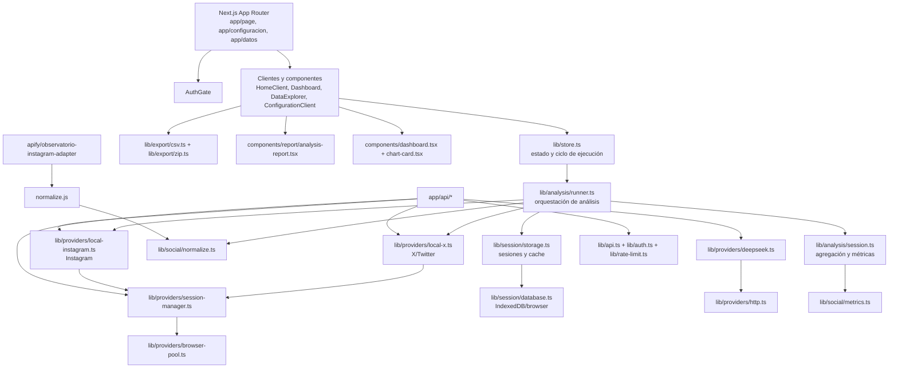

# Mapa del proyecto

Generado con Code-Graph-RAG mediante su índice offline Tree-sitter, activando
estructura, imports, llamadas y tipos. El análisis cubre TypeScript, TSX y
JavaScript del proyecto.

## Resumen estructural

- 64 módulos fuente.
- 95 archivos detectados: 41 `.ts`, 16 `.tsx`, 4 `.mjs` y 3 `.js`, además de
  configuración, documentación y datos.
- 562 funciones, 26 interfaces, 9 tipos y 1 clase explícita.
- 178 relaciones `IMPORTS`.
- 681 relaciones `CALLS`.
- 598 relaciones `DEFINES`.
- 24 paquetes externos y 17 módulos externos.

El índice bruto contiene 1.054 nodos y 2.461 relaciones. Code-Graph-RAG
incluyó 220 nodos de carpetas bajo `.git`; no representan arquitectura de la
aplicación y deben ignorarse al consultar el grafo.

## Arquitectura detectada

## Flujos principales

### Ejecución de análisis

`HomeClient` consume `lib/store.ts`. El store inicia `runAnalysis`, que
coordina la obtención de datos desde X e Instagram, normaliza perfiles/posts,
aplica análisis de sentimiento y temas mediante DeepSeek, agrega métricas y
guarda checkpoints/sesiones para permitir resultados parciales y cancelación.

### API y proveedores

- `/api/twitter` depende de `local-x`, autenticación común y rate limiting.
- `/api/apify` depende de `local-instagram`, autenticación común y rate
  limiting.
- `/api/deepseek` depende de `providers/deepseek` y del cliente HTTP común.
- `/api/scraper/auth` depende de `session-manager`.
- `/api/auth/*` centraliza login, logout y consulta de estado.
- `session-manager` reutiliza `browser-pool`; los proveedores locales X e
  Instagram comparten ese subsistema.

### Presentación y exportación

`HomeClient` conecta el store con `Dashboard`, `ComparisonPanel`,
`DataExplorer`, `AnalysisReport` y los exportadores CSV/ZIP. `Dashboard`
consume métricas, wordcloud y componentes de gráficos; `DataExplorer` usa
normalización/métricas y exportación CSV.

### Persistencia

El grafo muestra `lib/session/storage.ts`, `accounts.ts`, `database.ts` y
`sentiment-cache.ts` como la capa de sesiones/configuración/cache del cliente.
Esto coincide con el diseño stateless descrito en el README: no se detectó una
base de datos de servidor como dependencia de la aplicación.

## Módulos más conectados

Por imports internos, los módulos con mayor entrada son:

| Módulo | Importadores detectados |
| --- | ---: |
| `types/social.ts` | 17 |
| `types/analysis.ts` | 12 |
| `lib/utils.ts` | 11 |
| `components/ui.tsx` | 8 |
| `lib/api.ts` | 5 |
| `lib/export/csv.ts` | 5 |
| `lib/rate-limit.ts` | 4 |
| `lib/providers/session-manager.ts` | 3 |
| `lib/store.ts` | 3 |
| `lib/session/database.ts` | 3 |

Los mayores concentradores de lógica por cantidad de funciones son
`components/dashboard.tsx`, `lib/providers/local-x.ts`,
`components/configuration-client.tsx`, `lib/analysis/runner.ts` y
`components/home-client.tsx`. Conviene tratarlos como puntos prioritarios para
futuras refactorizaciones o pruebas de integración.

## Limitaciones del análisis

- Se generó el índice offline; no se levantó Memgraph/Qdrant porque el daemon
  de Docker no estaba disponible.
- La instalación de Code-Graph-RAG no incluía `ast-grep-py`, por lo que no se
  analizaron findings estructurales ni code smells.
- 564 relaciones quedaron con tipo protobuf `UNSPECIFIED`, principalmente
  llamadas/definiciones hacia funciones anónimas o anidadas. No deben
  interpretarse automáticamente como dependencias faltantes.
- El índice se generó fuera del repositorio y no se añadieron artefactos
  binarios al control de versiones.
